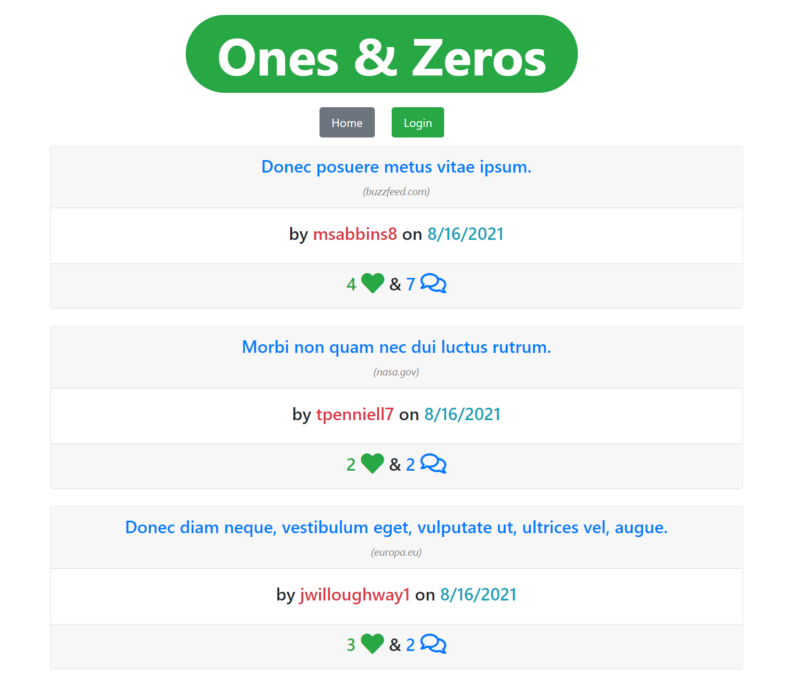

# Ones & Zeros

## License

## Table of Contents

1. [Project Description](#project-description)
2. [Installation Instructions](#installation-instructions)
3. [Usage Information](#usage-information)
4. [Contributor Guidelines](#contributor-guidelines)
5. [Testing Instructions](#testing-instructions)
6. [License Info](#license-info)
7. [Questions](#questions)

## Visual Demonstration

[CLICK HERE FOR THE FULL DEMONSTRATION VIDEO!]()

## Project Description

* A tech blog site where users can post and comment about the latest developer technologies 

## Installation Instructions

* Pull the Github repository to your local drive, open it in an IDE and enter "npm install" in the terminal to install the dependent modules from the package.json file in the root folder.
* link your MySQL login information to the connection.js file by creating a .env file in the root folder and entering the following data:
    *   DB_NAME='ecommerce_db'
    *   DB_USER='Username'
    *   DB_PW='password'
* Open the MySQL shell and create the database by entering source db/schemal.sql in the MySQL shell. Then enter quit in the terminal to exit the MySQL shell.
* Then enter npm run seed into the terminal to seed the sample data into the database.
* Then enter NPM start in the terminal to open port 3001.
* Once you open the port you can enter API requests using Insomnia as show in the demonstration video.

## Usage Information

* 

## Contributor Guidelines

* [Submit bugs and feature requests](https://github.com/joshsands/ones-and-zeros-blog/issues).
* Review [source code changes](https://github.com/joshsands/ones-and-zeros-blog/pulls).

## Test Instructions

* None

## License Info

Copyright 2021
The source code for the site is licensed under the MIT license and can be found at the link below:
[License Info Link](https://opensource.org/licenses/MIT)
      

## Questions?

* Find me on Github at [Joshsands](http://github.com/Joshsands).
* E-mail me at josh.sands@mail.com.